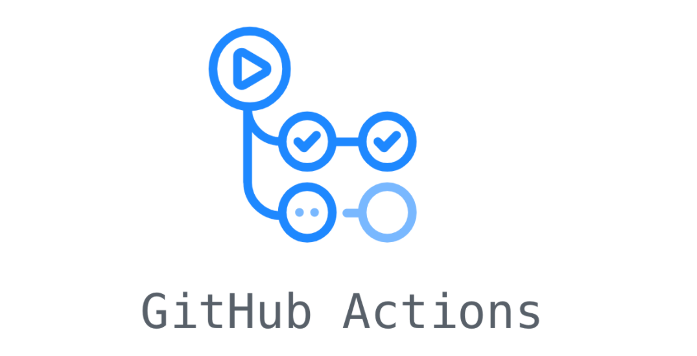

# Github Actions

  

## Documentation

* Explore the Github actions [documents](https://docs.github.com/en/actions)

## Published articles:

 - [Github actions - AWS](https://github.com/software-solutions-architect/github-runner/tree/main/aws)

## Contributions:

All contributions are welcomed. Help me to enrich this repository.

If you find any **bugs** in the examples, please file an issue.

### installation
* install [Graphviz](https://graphviz.gitlab.io/download/)
* install requirements `pip install requirements`
* generate new diagram `python main.py` in the specific dir e.g. aws

### TODO:

 - [ ] Adding Github actions GCP
 - [ ] Adding Github actions Azure
 - [ ] Adding Github actions on-premise
