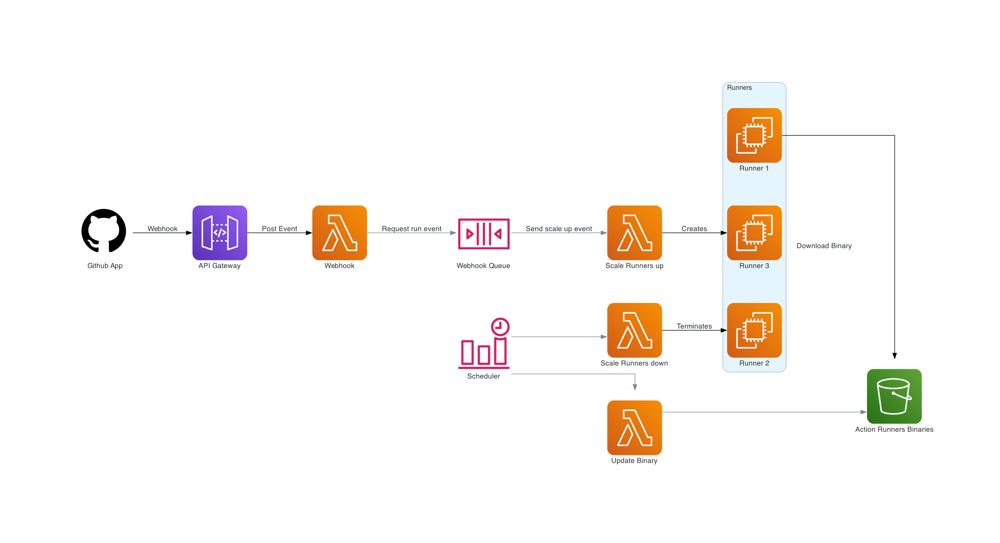

# Github Actions AWS
inspired from [philips-labs](https://github.com/philips-labs/terraform-aws-github-runner)

    

### TODO:

 - [ ] Adding template images 
 - [ ] Adding auto low-price spot instances finder
